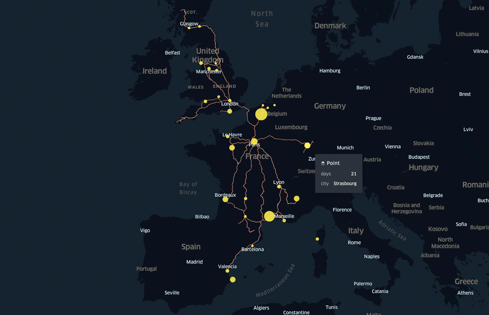

# ntag.fr — Devenir digital nomad

Ce repo contient le script que j’ai utilisé pour créer la carte de mon article sur le bilan de mon année en tant que digital nomad : https://ntag.fr/devenir-digital-nomad/

Le script sort deux fichiers :

- `cities.json` : la liste des villes où j'ai résidé, avec la durée en jours ;
- `trips.json` : la liste des trajets en train que j'ai effectués (il manque les trajets en bus et bateau, tant pis).

Pour réaliser la carte, j’ai simplement utilisé https://kepler.gl/demo où j’ai importé les deux fichiers précédents.



## Dev

Pour exécuter le script et re-créer les fichiers, il faut Node ≥ 16, puis :

```bash
npm i
npm start
```

## Outils utilisés

- Pour mapper une ville avec sa localisation géographique, j’utilise [all-the-cities](https://www.npmjs.com/package/all-the-cities) et [fast-levenshtein](https://www.npmjs.com/package/fast-levenshtein) afin de pouvoir faire cette recherche hors-ligne, sans utiliser d’API ;
- Pour trouver le trajet en train entre deux coordonnées GPS, j’utilise mon précédent projet [trainmap](https://github.com/NTag/trainmap), lui-même basé sur Raildar. Là ça se passe en ligne. C’est pas 100% exact, d’ailleurs il y a parfois des glitches, mais globalement c'est acceptable.
